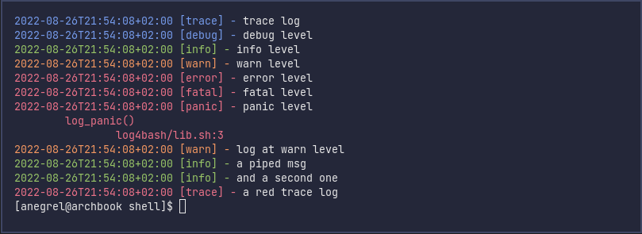

# `log4bash` - Minimal log library for bash.

## :question: Why ?

I was tired of writing the same log functions for my bash scripts.


## Getting started

`log4bash` is a one file library, you can just source and start using it as follow:
```shell
set -euo pipefail

source log4bash/lib.sh

# Set log level (one of "trace" "debug" "info" "warn" "error" "fatal" "panic" "disabled")
LOG_LEVEL="trace"

# Default to stderr
LOG_OUTPUT=/dev/stdout

# There is one function per log level
log_trace "trace log"
log_debug "debug level"
log_info "info level"
log_warn "warn level"
log_error "error level"
# The following log functions runs in a subshell
# as they return a non zero exit code
(log_fatal "fatal level")
# At panic level a stacktrace is print
(log_panic "panic level")

# Dynamic level
log "warn" "log at warn level"

# All of the above function works also through a pipe
echo -e "a piped msg\nand a second one" | log_info

# You can customize colors as follow.
# Change the color for the trace level
_log_level_color["trace"]="red"
# Or change the red color
_log_color["red"]="31"

log_trace "a red trace log"

# If you don't want colors, you can remove them as follow
unset _log_level_color

# And more...
# log4bash code is self documented, don't hesitate to read it !
```



## Contributing

If you want to contribute to `log4bash` to add a feature or improve the code contact
me at [negrel.dev@protonmail.com](mailto:negrel.dev@protonmail.com), open an
[issue](https://github.com/negrel/log4bash/issues) or make a
[pull request](https://github.com/negrel/log4bash/pulls).

## :stars: Show your support

Please give a :star: if this project helped you!

[](https://www.buymeacoffee.com/negrel)

## :scroll: License

MIT © [Alexandre Negrel](https://www.negrel.dev/)
